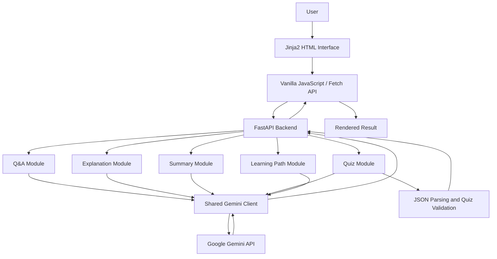

# EduGenie

EduGenie is a lightweight, browser-based educational assistant that uses Google Gemini to help learners ask questions, understand concepts, summarize educational passages, generate multiple-choice quizzes, and create structured learning paths. It is intended for students and self-learners and is built with a FastAPI backend, a Jinja2-rendered HTML interface, vanilla JavaScript, responsive CSS, and the Google Gen AI Python SDK.

> **Note:** EduGenie generates AI-assisted educational content. Responses may be incomplete or inaccurate and should be verified when used for important academic work.

## Features

### Core Features

- Answer academic and general-knowledge questions.
- Explain concepts in beginner-friendly language.
- Summarize educational passages.
- Generate three multiple-choice questions from a topic or passage.
- Display four options for every generated quiz question.
- Check quiz answers directly in the browser.
- Generate structured beginner-to-advanced learning paths.

### AI Features

- Uses Google Gemini through the `google-genai` Python package.
- Uses task-specific prompts for:
  - Question answering
  - Concept explanation
  - Summarization
  - Quiz generation
  - Learning-path generation
- Supports model selection through the `GEMINI_MODEL` environment variable.
- Requests structured JSON for quiz generation.
- Validates generated quiz data before returning it to the frontend.
- Handles missing keys, invalid keys, unavailable models, empty responses, and API quota errors.

### Backend Features

- FastAPI application with JSON REST endpoints.
- Pydantic request validation.
- Modular Python files for each learning feature.
- Jinja2 template rendering.
- Static-file serving for CSS and JavaScript.
- Health-check endpoint.
- Automatically generated OpenAPI and Swagger UI documentation.
- Centralized Gemini API configuration.

### Frontend Features

- Responsive HTML and CSS interface.
- Tab-based navigation between learning tools.
- Asynchronous requests using the browser Fetch API.
- Loading, error, and result states.
- Interactive quiz answer checking.
- Submit-button disabling while requests are in progress.
- Mobile-friendly layout.

### Security and Configuration

- Gemini credentials are loaded from environment variables.
- The API key does not need to be placed in source code.
- `.env` can be excluded from Git through `.gitignore`.
- User input is validated by Pydantic before feature modules process it.
- Generated quiz data is structurally validated before being sent to the browser.

### Data and Database

- No database is implemented.
- No user information, generated content, or learning progress is persisted.
- Application state exists only for the duration of each request and browser session.

### Testing

- A health-check endpoint is available for basic runtime verification.
- FastAPI's interactive Swagger UI can be used for manual endpoint testing.
- No automated test suite is currently included.

---

## Technology Stack

| Category | Technology |
|----------|------------|
| Language | Python, JavaScript, HTML, CSS |
| Frontend | HTML5, CSS3, vanilla JavaScript, Fetch API |
| Backend | FastAPI |
| Templates | Jinja2 |
| Server | Uvicorn |
| Validation | Pydantic |
| Database | Not implemented |
| AI/ML | Google Gemini through the `google-genai` Python SDK |
| Authentication | Not implemented |
| APIs | Internal FastAPI REST API; external Google Gemini API |
| Testing | Manual testing through the web interface, `/health`, and Swagger UI |
| Deployment | Local Uvicorn execution; production platform not specified |
| Configuration | `python-dotenv` and `.env` environment variables |

---

## Project Architecture

EduGenie follows a small modular web-application architecture.

### Frontend

`templates/index.html` contains the Jinja2-rendered user interface. The interface provides separate sections for questions, explanations, summaries, quizzes, and learning paths.

`static/script.js` handles form submissions, sends JSON requests to the FastAPI backend, renders returned content, and implements browser-side quiz answer checking.

`static/style.css` provides the responsive application layout and component styling.

### Backend

`main.py` creates the FastAPI application, mounts static assets, configures Jinja2, defines request models, and exposes the application's routes.

Each educational feature is implemented in a separate Python module:

- `qna.py`
- `explanation_module.py`
- `summary_module.py`
- `quiz_module.py`
- `learning_path.py`

### AI Integration

`config.py` loads the API key and model name from `.env`, creates the Google Gen AI client, and provides the shared text-generation function used by the feature modules.

### Database and Authentication

EduGenie currently has no database and no authentication system. It does not create user accounts or persist learning history.

### Data Flow

1. The user enters a question, topic, or passage in the browser.
2. JavaScript sends a JSON `POST` request to the corresponding FastAPI endpoint.
3. FastAPI validates the JSON body with a Pydantic model.
4. The endpoint calls the appropriate Python feature module.
5. The feature module constructs a task-specific prompt.
6. `config.py` sends the prompt to the configured Gemini model.
7. The backend returns the result as JSON.
8. JavaScript displays the response in the browser.
9. For quizzes, JavaScript checks selected answers against the validated answer returned by the backend.



---

## Project Structure

```text
EduGenie/
├── static/
│   ├── script.js              # Fetch requests and frontend interactivity
│   └── style.css              # Responsive application styling
├── templates/
│   └── index.html             # Main Jinja2 frontend template
├── .env                       # Local API configuration; do not commit
├── .gitignore                 # Files excluded from Git
├── config.py                  # Environment loading and Gemini client
├── explanation_module.py      # Concept explanation logic
├── learning_path.py           # Learning-path generation logic
├── main.py                    # FastAPI application and routes
├── qna.py                     # Question-answering logic
├── quiz_module.py             # Quiz generation, parsing, and validation
├── requirements.txt           # Python dependencies
└── summary_module.py          # Summarization logic
```

If `run.py` is present in a local copy, it is an optional launcher. The documented and directly supported startup command is:

```bash
python -m uvicorn main:app
```

---

## Prerequisites

Before installing EduGenie, ensure that the following are available:

- Python 3.10 or newer
- `pip`
- Internet access for Gemini API requests
- A Google Gemini API key
- A modern web browser
- Git, if cloning the project from GitHub

Check Python:

```bash
python --version
```

On Windows, the Python launcher can also be used:

```powershell
py --version
```

---

## Installation

### 1. Clone the repository

```bash
git clone https://github.com/YOUR_USERNAME/YOUR_REPOSITORY.git
cd YOUR_REPOSITORY
```

Replace the example repository URL with the actual GitHub URL.

Alternatively, download the repository as a ZIP file, extract it, and open the extracted folder in a terminal.

### 2. Create a virtual environment

#### Windows PowerShell

```powershell
py -m venv .venv
```

#### macOS or Linux

```bash
python3 -m venv .venv
```

### 3. Activate the virtual environment

#### Windows PowerShell

```powershell
.\.venv\Scripts\Activate.ps1
```

If PowerShell blocks script execution for the current terminal:

```powershell
Set-ExecutionPolicy -Scope Process -ExecutionPolicy Bypass
.\.venv\Scripts\Activate.ps1
```

#### Windows Command Prompt

```cmd
.venv\Scripts\activate.bat
```

#### macOS or Linux

```bash
source .venv/bin/activate
```

Activation is optional. Commands can also be run directly through the virtual environment's Python executable.

### 4. Install dependencies

```bash
python -m pip install --upgrade pip
python -m pip install -r requirements.txt
```

Without activating the environment on Windows:

```powershell
.\.venv\Scripts\python.exe -m pip install --upgrade pip
.\.venv\Scripts\python.exe -m pip install -r .\requirements.txt
```

---

## Environment Configuration

Create a `.env` file in the project root, beside `main.py`.

```env
GOOGLE_API_KEY=YOUR_GEMINI_API_KEY
GEMINI_MODEL=gemini-2.5-flash
```

### Variables

| Variable | Required | Description |
|----------|----------|-------------|
| `GOOGLE_API_KEY` | Yes | API key used to access Google Gemini |
| `GEMINI_MODEL` | No | Gemini model identifier; the application defaults to `gemini-2.5-flash` if not set |

The model must be available to the configured API key. If a different supported Gemini model is required, update `GEMINI_MODEL` without changing the Python modules.

### API key security

Do not commit `.env` to Git. Add the following to `.gitignore`:

```gitignore
.env
.venv/
__pycache__/
*.pyc
.vscode/
```

A safe `.env.example` may be committed with placeholders:

```env
GOOGLE_API_KEY=YOUR_GEMINI_API_KEY
GEMINI_MODEL=gemini-2.5-flash
```

If a real key is accidentally committed:

1. Revoke it in Google AI Studio.
2. Create a replacement key.
3. Update the local `.env`.
4. Remove the exposed value from the repository history as needed.

---

## Running the Application

From the directory containing `main.py`, run:

```bash
python -m uvicorn main:app
```

For development with automatic reload:

```bash
python -m uvicorn main:app --reload
```

On Windows, without activating the virtual environment:

```powershell
.\.venv\Scripts\python.exe -m uvicorn main:app
```

When startup succeeds, Uvicorn displays:

```text
Uvicorn running on http://127.0.0.1:8000
```

Open the application:

```text
http://127.0.0.1:8000
```

Other local URLs:

| Resource | URL |
|----------|-----|
| Application | `http://127.0.0.1:8000/` |
| Health check | `http://127.0.0.1:8000/health` |
| Swagger UI | `http://127.0.0.1:8000/docs` |
| OpenAPI schema | `http://127.0.0.1:8000/openapi.json` |

Stop the server with `Ctrl+C`.

---

## API Reference

All feature endpoints accept and return JSON.

### `GET /`

Renders the main Jinja2 frontend.

### `GET /health`

Returns the application status, API configuration state, and configured model.

Example response:

```json
{
  "status": "ok",
  "api_configured": true,
  "model": "gemini-2.5-flash"
}
```

`api_configured: true` confirms that a non-placeholder API key was loaded. It does not independently verify a successful Gemini request.

---

### `POST /qa`

Answers an educational or general-knowledge question.

#### Request

```json
{
  "question": "Which is the largest ocean?"
}
```

#### Response

```json
{
  "answer": "The Pacific Ocean is the largest ocean on Earth."
}
```

---

### `POST /explain`

Generates a beginner-friendly explanation of a topic.

#### Request

```json
{
  "topic": "Photosynthesis"
}
```

#### Response

```json
{
  "topic": "Photosynthesis",
  "explanation": "Generated explanation..."
}
```

---

### `POST /summarize`

Summarizes a passage. The backend requires a sufficiently long input passage.

#### Request

```json
{
  "text": "The Industrial Revolution began in Great Britain during the late eighteenth century..."
}
```

#### Response

```json
{
  "summary": "Generated summary..."
}
```

---

### `POST /quiz`

Generates exactly three multiple-choice questions from a topic or passage.

#### Request

```json
{
  "text": "The Pythagorean theorem"
}
```

#### Response

```json
{
  "quiz": [
    {
      "question": "What type of triangle does the Pythagorean theorem apply to?",
      "options": [
        "Right-angled triangles",
        "Equilateral triangles",
        "All triangles",
        "Isosceles triangles only"
      ],
      "answer": "Right-angled triangles"
    }
  ]
}
```

The complete successful response contains three questions. Every validated question contains:

- A non-empty `question`
- Exactly four different `options`
- An `answer` that exactly matches one option

The generated answer is sent to the browser so the client can provide immediate feedback. This is suitable for self-assessment, but it is not a secure examination system.

---

### `POST /learn/recommendations`

Creates a structured learning path.

#### Request

```json
{
  "topic": "SQL"
}
```

#### Response

```json
{
  "topic": "SQL",
  "recommendation": "Generated beginner-to-advanced learning plan..."
}
```

---

## Request Validation and Errors

FastAPI and Pydantic validate incoming JSON. Depending on the failure, the API may return:

- `400` for invalid feature input handled by a module
- `422` for request-body validation failures
- `502` when a downstream Gemini request or response-processing operation fails

Example error:

```json
{
  "detail": "Gemini API key is missing. Open the .env file and add your actual API key."
}
```

Common external-service failures handled by the configuration module include:

- Missing API key
- Invalid API key
- Unsupported or unavailable model
- API rate limit or quota exhaustion
- Empty Gemini response
- Other Gemini request failures

---

## Usage Examples

### Ask a question

```bash
curl -X POST "http://127.0.0.1:8000/qa" \
  -H "Content-Type: application/json" \
  -d "{\"question\":\"What is gravity?\"}"
```

### Explain a topic

```bash
curl -X POST "http://127.0.0.1:8000/explain" \
  -H "Content-Type: application/json" \
  -d "{\"topic\":\"Binary search\"}"
```

### Summarize text

```bash
curl -X POST "http://127.0.0.1:8000/summarize" \
  -H "Content-Type: application/json" \
  -d "{\"text\":\"Paste a sufficiently long educational passage here for summarization.\"}"
```

### Generate a quiz

```bash
curl -X POST "http://127.0.0.1:8000/quiz" \
  -H "Content-Type: application/json" \
  -d "{\"text\":\"The Pythagorean theorem\"}"
```

### Generate a learning path

```bash
curl -X POST "http://127.0.0.1:8000/learn/recommendations" \
  -H "Content-Type: application/json" \
  -d "{\"topic\":\"SQL\"}"
```

PowerShell users can test the Q&A endpoint with:

```powershell
Invoke-RestMethod `
  -Method Post `
  -Uri "http://127.0.0.1:8000/qa" `
  -ContentType "application/json" `
  -Body '{"question":"What is gravity?"}'
```

---

## Manual Testing

No automated test suite is included. Use the following checks after installation.

### 1. Import check

```bash
python -c "import main; print('MAIN IMPORT SUCCESSFUL')"
```

### 2. Health check

Start the server, then open:

```text
http://127.0.0.1:8000/health
```

Confirm:

- `status` is `ok`
- `api_configured` is `true`
- `model` contains the expected model identifier

### 3. Functional checks

| Feature | Example Input | Expected Behavior |
|---------|---------------|-------------------|
| Q&A | `Which is the largest ocean?` | Displays an educational answer |
| Explanation | `Photosynthesis` | Displays a beginner-friendly explanation |
| Summary | A multi-sentence passage | Displays a shorter summary |
| Quiz | `Pythagorean theorem` | Displays three questions with four options each |
| Quiz checking | Select an option | Shows correct or incorrect feedback |
| Learning path | `SQL` | Displays a structured learning plan |

### 4. API testing

Open:

```text
http://127.0.0.1:8000/docs
```

Expand an endpoint, select **Try it out**, enter the JSON body, and select **Execute**.

---

## Troubleshooting

### Uvicorn cannot import `main`

Ensure the terminal is in the directory containing `main.py`:

```powershell
Get-ChildItem .\main.py
```

Then run:

```powershell
python -m uvicorn main:app
```

### `requirements.txt` cannot be found

Confirm the terminal location and file name:

```powershell
Get-Location
Get-ChildItem .\requirements.txt
```

Run installation from the project root:

```powershell
python -m pip install -r .\requirements.txt
```

### PowerShell will not activate the environment

Use the virtual environment directly:

```powershell
.\.venv\Scripts\python.exe -m pip install -r .\requirements.txt
.\.venv\Scripts\python.exe -m uvicorn main:app
```

### API key is reported as missing

Confirm `.env` is in the same directory as `main.py`:

```text
EduGenie/
├── .env
└── main.py
```

The file must contain:

```env
GOOGLE_API_KEY=YOUR_ACTUAL_KEY
GEMINI_MODEL=gemini-2.5-flash
```

Restart the server after editing `.env`.

### Model not found

Set `GEMINI_MODEL` to a Gemini model that is available to the configured account and API version. The project's default configuration is:

```env
GEMINI_MODEL=gemini-2.5-flash
```

Do not use an unverified model identifier.

### Gemini request limit reached

A `429` or `RESOURCE_EXHAUSTED` response indicates that the configured Gemini quota or rate limit was reached. Wait and try again, or review the quota associated with the API project.

### Quiz generation fails

Quiz generation requires Gemini to return valid JSON matching the expected schema. Retry the request if the model returns malformed or incomplete output.

---

## Security Considerations

- Never commit the real `.env` file.
- Never expose the Gemini API key in frontend JavaScript.
- Revoke any key that has been published accidentally.
- The application has no authentication or authorization.
- All users who can access the running server can call its endpoints.
- No application-level rate limiting is implemented.
- Input length is limited by Pydantic fields, but deployment-level request limits are not configured.
- Generated content should not be treated as verified academic authority.
- Quiz answers are returned to the frontend and are not protected from inspection.
- Production deployment should add appropriate access controls, HTTPS, rate limiting, monitoring, and restrictive network configuration.

---

## Current Limitations

- A valid Gemini API key and internet connection are required for AI generation.
- AI-generated content may contain errors or unsupported claims.
- No user registration or sign-in is implemented.
- No database or persistent history is implemented.
- No progress tracking is implemented.
- No file or PDF upload is implemented.
- No voice interface is implemented.
- No multilingual interface is explicitly implemented.
- No local language model is loaded by the current dependency and configuration setup.
- No automated test suite is included.
- No container, CI/CD, or production hosting configuration is included.
- Learning paths are prompt-generated recommendations rather than stored curricula.

---

## Deployment

The repository documents local execution through Uvicorn:

```bash
python -m uvicorn main:app
```

A production deployment target is not specified. No Dockerfile, platform-specific deployment manifest, reverse-proxy configuration, or CI/CD workflow is included.

Before deploying publicly, consider adding:

- A production ASGI process configuration
- HTTPS termination
- Authentication and authorization
- Request rate limiting
- Logging and monitoring
- Secret management
- Dependency and vulnerability scanning
- Automated tests
- Restrictive CORS and trusted-host settings where applicable

These items are recommendations and are not implemented by the current project.

---

## Contributing

A project-specific contribution policy is not currently specified. A typical local contribution workflow is:

1. Fork the repository.
2. Create a branch:

   ```bash
   git checkout -b feature/short-description
   ```

3. Make and manually test the changes.
4. Ensure `.env` and virtual-environment files are not staged.
5. Commit the changes:

   ```bash
   git add .
   git commit -m "Describe the change"
   ```

6. Push the branch and open a pull request.

Keep feature logic modular and update this README when routes, environment variables, dependencies, or setup commands change.

---

## License

No license is specified in the supplied project contents.

Until a license file is added, the absence of a license means reuse, redistribution, and modification rights are not explicitly granted. Add a `LICENSE` file before presenting the repository as open source.

---

## Acknowledgements

EduGenie uses:

- [FastAPI](https://fastapi.tiangolo.com/) for the backend API
- [Uvicorn](https://www.uvicorn.org/) as the ASGI server
- [Jinja2](https://jinja.palletsprojects.com/) for HTML templates
- [Google Gen AI SDK](https://googleapis.github.io/python-genai/) for Gemini integration
- [Google AI Studio](https://aistudio.google.com/) for Gemini API-key provisioning
